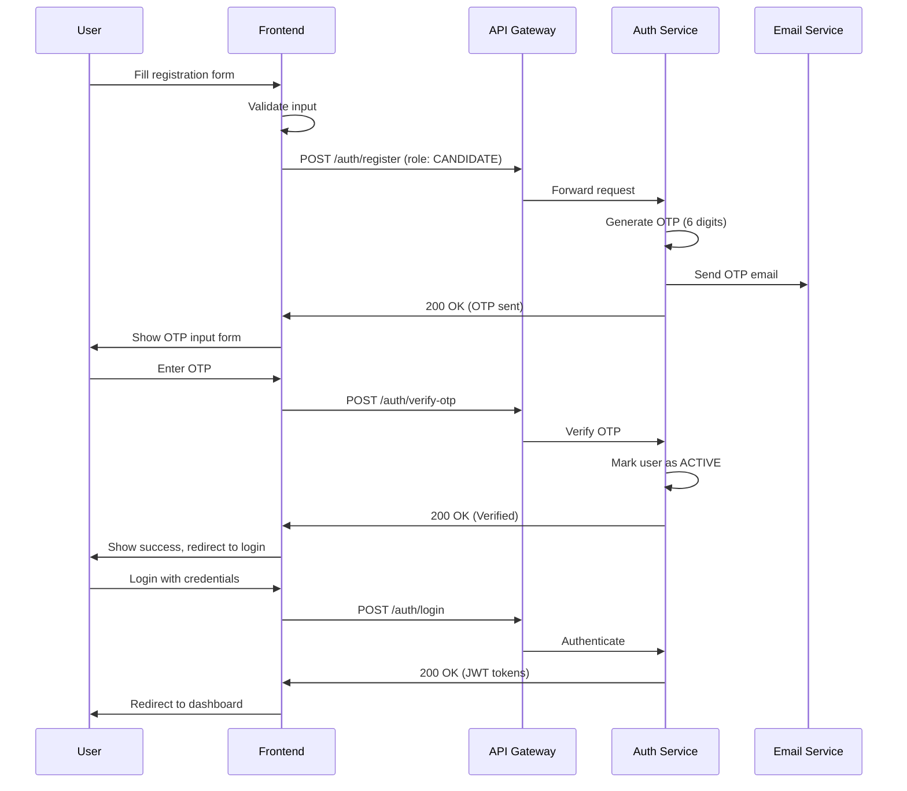
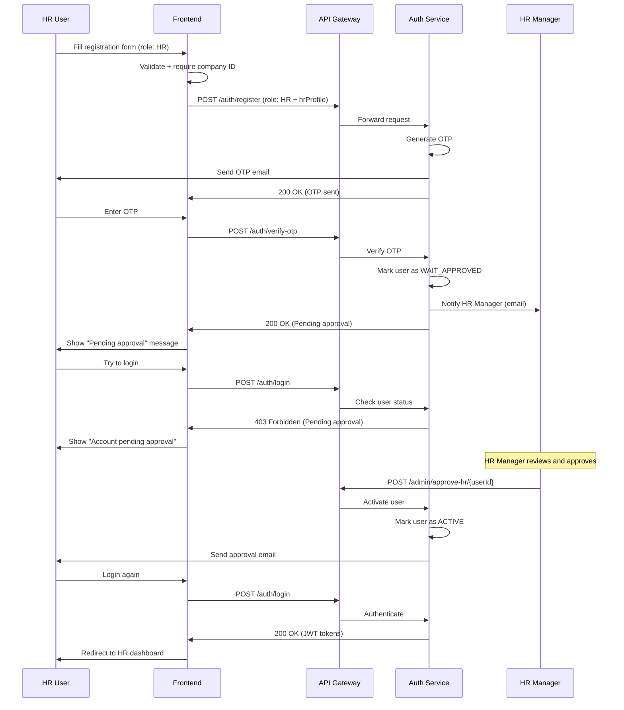
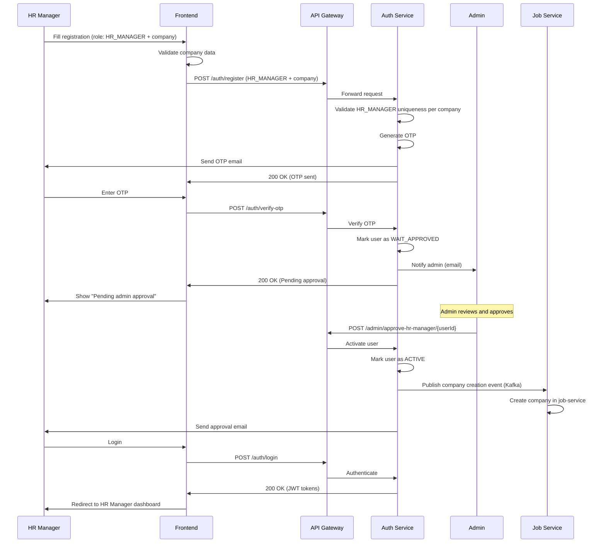
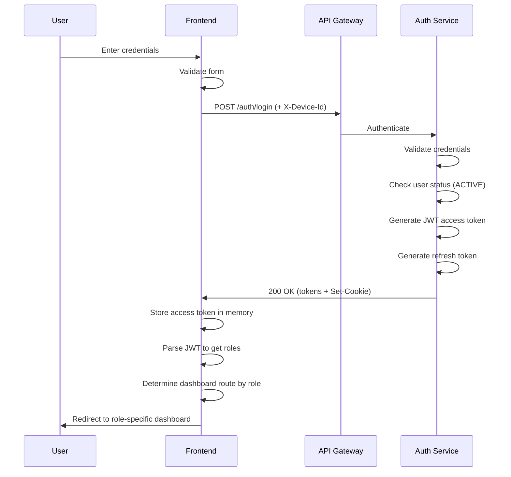

# Authentication Flows

**Last Updated**: 2025-12-08
**Version**: 0.0.1-SNAPSHOT
**Project**: WorkFitAI Platform

## Overview

This document describes complete authentication and authorization flows for the WorkFitAI platform, including registration, login, token management, and role-based access control for all user types.

---

## User Roles

### Role Hierarchy

```
ADMIN (System Administrator)
  ├─ Full system access
  ├─ User management
  └─ Platform configuration

HR_MANAGER (HR Manager)
  ├─ Company management
  ├─ Job posting CRUD
  ├─ Application review
  ├─ Approve HR staff
  └─ Analytics

HR (HR Staff)
  ├─ Job posting CRUD (own company)
  ├─ Application review (own company)
  └─ Candidate communication

CANDIDATE (Job Seeker)
  ├─ Browse published jobs
  ├─ Submit applications
  ├─ Manage own profile
  └─ Track application status
```

### Role Permissions Matrix

| Feature             | CANDIDATE | HR              | HR_MANAGER      | ADMIN   |
| ------------------- | --------- | --------------- | --------------- | ------- |
| View published jobs | ✓         | ✓               | ✓               | ✓       |
| Submit application  | ✓         | ✗               | ✗               | ✗       |
| Create job posting  | ✗         | ✓               | ✓               | ✓       |
| Review applications | ✗         | ✓ (own company) | ✓ (own company) | ✓ (all) |
| Approve HR staff    | ✗         | ✗               | ✓               | ✓       |
| Approve HR manager  | ✗         | ✗               | ✗               | ✓       |
| Manage users        | ✗         | ✗               | ✗               | ✓       |

---

## 1. Registration Flows

### 1.1 Candidate Registration (Auto-Activation)

**Flow**: Register → OTP Verification → Auto-Activated → Login



**Frontend Implementation**:

```typescript
// Step 1: Registration
async function registerCandidate(data: CandidateRegisterForm) {
  const response = await apiClient.post("/auth/register", {
    email: data.email,
    password: data.password,
    role: "CANDIDATE",
    fullName: data.fullName,
    phoneNumber: data.phoneNumber,
  });

  if (response.success) {
    // Navigate to OTP verification page
    router.push(`/verify-otp?email=${encodeURIComponent(data.email)}`);
  }
}

// Step 2: OTP Verification
async function verifyOtp(email: string, otp: string) {
  const response = await apiClient.post("/auth/verify-otp", {
    email,
    otp,
  });

  if (response.success) {
    // Show success message
    showNotification("Account verified successfully! Please log in.");
    // Navigate to login page
    router.push("/login");
  }
}

// Step 3: Login
async function login(credentials: LoginForm) {
  const response = await authService.login({
    usernameOrEmail: credentials.usernameOrEmail,
    password: credentials.password,
  });

  if (response.success) {
    // Store tokens and redirect
    setAuthState(response.data);
    router.push("/candidate/dashboard");
  }
}
```

**UI States**:

1. **Registration Form**: Email, password, full name, phone number
2. **OTP Input**: 6-digit code input with resend option
3. **Success Message**: Redirect to login after 2 seconds
4. **Login Form**: Username/email and password

---

### 1.2 HR Staff Registration (Requires Approval)

**Flow**: Register → OTP Verification → Pending Approval → HR Manager Approves → Login



**Frontend Implementation**:

**UI States**:

1. **Registration Form**: Email, password, full name, phone, [company, department (only for HRs)]
2. **OTP Verification**: Same as candidate
3. **Pending Approval**: Warning banner, disable login
4. **Approval Email**: Notification when approved
5. **Login Enabled**: Can log in after approval

---

### 1.3 HR Manager Registration (Admin Approval)

**Flow**: Register → OTP → Pending → Admin Approves → Company Created → Login



**Frontend Implementation**:

**UI States**:

1. **Registration Form**: Personal info + complete company profile
2. **Company Info Section**: Company name, logo, website, description, size
3. **OTP Verification**: Standard OTP flow
4. **Pending Admin Approval**: Special banner for admin approval
5. **Post-Approval**: Can log in and manage company

---

## 2. Login Flow

### 2.1 Standard Login Flow



**Frontend Implementation**:

## 3. Role-Based Access Control

### 3.1 Route Guards

```typescript
// React example with React Router
import { Navigate, useLocation } from "react-router-dom";

interface ProtectedRouteProps {
  children: React.ReactNode;
  allowedRoles: string[];
}

function ProtectedRoute({ children, allowedRoles }: ProtectedRouteProps) {
  const location = useLocation();

  if (!authService.isAuthenticated()) {
    // Redirect to login, save intended destination
    return <Navigate to="/login" state={{ from: location }} replace />;
  }

  const userRoles = authService.getUserRoles();
  const hasAccess = allowedRoles.some((role) =>
    userRoles.includes(`ROLE_${role}`)
  );

  if (!hasAccess) {
    // Redirect to unauthorized page
    return <Navigate to="/unauthorized" replace />;
  }

  return <>{children}</>;
}

// Usage
<Routes>
  {/* Public routes */}
  <Route path="/login" element={<LoginPage />} />
  <Route path="/register" element={<RegisterPage />} />
  <Route path="/jobs" element={<PublicJobsPage />} />

  {/* Candidate routes */}
  <Route
    path="/candidate/*"
    element={
      <ProtectedRoute allowedRoles={["CANDIDATE"]}>
        <CandidateLayout />
      </ProtectedRoute>
    }
  />

  {/* HR routes */}
  <Route
    path="/hr/*"
    element={
      <ProtectedRoute allowedRoles={["HR", "HR_MANAGER"]}>
        <HRLayout />
      </ProtectedRoute>
    }
  />

  {/* Admin routes */}
  <Route
    path="/admin/*"
    element={
      <ProtectedRoute allowedRoles={["ADMIN"]}>
        <AdminLayout />
      </ProtectedRoute>
    }
  />
</Routes>;
```

---

### 3.2 Component-Level Authorization

```typescript
// Hide/show UI elements based on permissions
function JobCard({ job }: { job: Job }) {
  const isHR = authService.hasRole("HR") || authService.hasRole("HR_MANAGER");
  const isCandidate = authService.hasRole("CANDIDATE");

  return (
    <Card>
      <CardContent>
        <Typography variant="h5">{job.title}</Typography>
        <Typography>{job.companyName}</Typography>

        {/* Candidate-only actions */}
        {isCandidate && (
          <Button onClick={() => applyToJob(job.postId)}>Apply Now</Button>
        )}

        {/* HR-only actions */}
        {isHR && (
          <>
            <Button onClick={() => editJob(job.postId)}>Edit</Button>
            <Button onClick={() => viewApplications(job.postId)}>
              View Applications ({job.totalApplications})
            </Button>
          </>
        )}
      </CardContent>
    </Card>
  );
}
```

---

### 3.3 API Permission Checks

```typescript
// Backend permissions are enforced via @PreAuthorize
// Frontend should mirror these checks for UI consistency

const PERMISSIONS = {
  CANDIDATE: {
    "application:create": true,
    "application:list": true,
    "application:read": true,
    "job:read": true,
  },
  HR: {
    "job:create": true,
    "job:update": true,
    "job:delete": true,
    "application:review": true,
    "application:update_status": true,
  },
  HR_MANAGER: {
    "job:create": true,
    "job:update": true,
    "job:delete": true,
    "application:review": true,
    "application:update_status": true,
    "hr:approve": true,
  },
  ADMIN: {
    "*": true, // All permissions
  },
};

function hasPermission(permission: string): boolean {
  const roles = authService.getUserRoles();

  return roles.some((role) => {
    const rolePerms = PERMISSIONS[role.replace("ROLE_", "")];
    return rolePerms?.["*"] === true || rolePerms?.[permission] === true;
  });
}

// Usage
if (hasPermission("application:create")) {
  // Show "Apply" button
}
```

---

## 4. Session Management

### 4.1 Session Persistence

```typescript
// Restore session on page load
class AuthService {
  constructor() {
    this.restoreSession();
  }

  private restoreSession(): void {
    const savedState = sessionStorage.getItem("authState");
    if (savedState) {
      try {
        this.authState = JSON.parse(savedState);

        // Check if token is still valid
        if (Date.now() >= this.authState.expiresAt) {
          // Token expired, try to refresh
          this.refreshToken();
        } else {
          // Schedule next refresh
          const remaining = this.authState.expiresAt - Date.now();
          this.scheduleTokenRefresh(remaining - 60000);
        }
      } catch (error) {
        console.error("Failed to restore session:", error);
        this.clearAuthState();
      }
    }
  }

  private clearAuthState(): void {
    this.authState = null;
    sessionStorage.removeItem("authState");
    if (this.refreshTimeout) {
      clearTimeout(this.refreshTimeout);
      this.refreshTimeout = null;
    }
  }
}
```

---

### 4.2 Multi-Tab Synchronization

```typescript
// Sync auth state across browser tabs
window.addEventListener("storage", (event) => {
  if (event.key === "logout-event") {
    // Another tab logged out
    authService.clearAuthState();
    router.push("/login");
  }
});

// Trigger logout in all tabs
function logoutAllTabs(): void {
  localStorage.setItem("logout-event", Date.now().toString());
  localStorage.removeItem("logout-event"); // Clear event
}
```

---

## 5. Security Best Practices

### 5.1 Token Storage

**DO**:

- ✅ Store access token in memory or sessionStorage
- ✅ Use HttpOnly cookies for refresh tokens (handled automatically)
- ✅ Include CSRF protection for cookie-based auth

**DON'T**:

- ❌ Store access token in localStorage (XSS vulnerability)
- ❌ Store refresh token in JavaScript (security risk)
- ❌ Send tokens in URL parameters

---

### 5.2 Password Security

```typescript
// Password validation on frontend
function validatePassword(password: string): string[] {
  const errors: string[] = [];

  if (password.length < 8) {
    errors.push("Password must be at least 8 characters");
  }
  if (password.length > 128) {
    errors.push("Password must be less than 128 characters");
  }
  if (!/[A-Z]/.test(password)) {
    errors.push("Password must contain at least one uppercase letter");
  }
  if (!/[a-z]/.test(password)) {
    errors.push("Password must contain at least one lowercase letter");
  }
  if (!/[0-9]/.test(password)) {
    errors.push("Password must contain at least one number");
  }

  return errors;
}
```

---

### 5.3 Device Tracking

```typescript
// Generate unique device ID for refresh token rotation
function generateDeviceId(): string {
  const fingerprint = [
    navigator.userAgent,
    navigator.language,
    screen.width,
    screen.height,
    new Date().getTimezoneOffset(),
  ].join("|");

  // Create hash (or use crypto.randomUUID for simpler approach)
  return crypto.randomUUID();
}
```

---

## Summary

This authentication flows guide covers:

1. **Registration Flows**: Candidate (auto-activate), HR (manager approval), HR Manager (admin approval)
2. **Login Flow**: Standard authentication with JWT tokens
3. **Token Management**: Access token refresh, automatic renewal
4. **Logout**: Session termination and cleanup
5. **Role-Based Access**: Route guards, component authorization, permission checks
6. **Session Management**: Persistence, multi-tab sync
7. **Security**: Token storage, password validation, device tracking

**Key Takeaways**:

- Always use API Gateway for requests
- Store access tokens in memory/sessionStorage only
- Implement automatic token refresh
- Use role-based route guards
- Mirror backend permissions in frontend UI
- Handle session expiry gracefully

**Next Steps**:

- Implement authentication service in your frontend framework
- Set up protected routes with role guards
- Create role-specific dashboards
- Test all registration and approval flows
